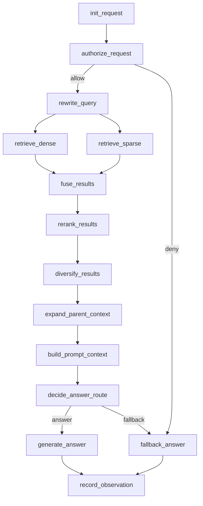

# RAG + LangGraph 架构升级设计文档

## 1. 背景与目标

当前项目的核心实现集中在 `rrf.py` 单文件中，已经具备一个可运行的基础 RAG 流程：

- 文档加载：`pdf / docx / md`
- 父子分块：`parent / child`
- 向量检索：`Chroma + HuggingFaceEmbeddings`
- 稀疏检索：`BM25`
- 混合召回：`MultiQuery + RRF`
- 重排与去冗余：`FlashrankRerank + MMR`
- 回答生成：`LLM + Prompt`

现阶段主要问题不是“能力缺失”，而是“工程化边界不清晰”：

- 单文件过于集中，摄入、索引、检索、生成、配置、运行入口全部耦合
- 检索流程是串行脚本，缺少稳定的状态模型与显式节点契约
- 缺少面向生产的索引更新机制，当前是“删除集合后全量重建”
- 缺少多用户、多权限、上下文隔离模型
- 缺少可观测性、评测、异常恢复、失败兜底
- 难以扩展到多数据源、异步任务、批量摄入、工作流回放

本次升级目标是先完成**架构设计**，输出一版适合后续逐步落地的方案，重点满足：

1. 项目分层分模块，摆脱单文件实现
2. 基于 `LangGraph` 重构检索问答主流程
3. 设计稳定的状态模型、明确的节点职责与输入输出契约
4. 设计文档摄入与索引更新机制
5. 设计可观测性与评测体系
6. 设计失败兜底与异常恢复机制
7. 设计面向多用户、多权限的上下文边界


## 2. 当前实现评估

## 2.1 现有流程

当前 `rrf.py` 的逻辑可以概括为：

1. 加载目录下所有文档
2. 进行 parent chunk 切分
3. 基于 parent 再切 child chunk
4. 将 child chunk 写入 Chroma
5. 构建 dense retriever 与 BM25 retriever
6. 对用户问题执行 query rewrite
7. 对每个 rewrite 执行 dense + bm25 检索
8. 使用 RRF 融合 child 命中
9. 对 child 结果 rerank
10. 对 child 结果执行 MMR 去冗余
11. 将 child 扩展回 parent
12. 将 parent context 送入 LLM 生成答案

## 2.2 主要架构问题

### 2.2.1 模块边界缺失

当前代码里至少混合了以下职责：

- 文档接入
- 文档切分
- 元数据生成
- 索引写入
- 检索编排
- 排序算法
- Prompt 构建
- 交互式 CLI

这些职责应拆分到独立模块，否则后续任何一个点升级都会影响全链路。

### 2.2.2 缺少稳定状态模型

现在的运行状态隐含在局部变量中，例如：

- `queries`
- `ranked_lists`
- `rrf_child_docs`
- `reranked_child_docs`
- `mmr_child_docs`
- `parent_docs`

这类隐式状态不利于：

- 工作流回放
- 节点失败重试
- 节点级观测
- 节点级测试
- 复杂分支扩展

### 2.2.3 索引构建不可增量

当前向量库处理方式是：

- 尝试删除整个 collection
- 重新创建 collection
- 全量写入 child docs

这只适合 demo，不适合真实生产环境。至少需要：

- 文档级版本管理
- 文件变更检测
- 增量更新
- 软删除/失效标记
- 重建策略与回滚策略

### 2.2.4 缺少租户与权限边界

当前检索默认对所有文档开放，没有：

- tenant 隔离
- user 权限范围过滤
- source scope 过滤
- session context 边界

### 2.2.5 缺少故障策略

当前任意一个步骤失败都可能直接中断：

- 重排模型不可用
- 向量库不可用
- Embedding 失败
- Query Rewrite 失败
- 单个文档解析失败

没有明确的降级路径。


## 3. 目标架构总览

建议将系统拆成四层：

1. `Interface` 接口层
2. `Application` 应用编排层
3. `Domain` 领域能力层
4. `Infrastructure` 基础设施层

核心原则：

- 接口层只负责接入，不写业务规则
- Application 负责用例编排与状态流转
- Domain 负责纯业务能力与契约
- Infrastructure 负责模型、数据库、向量库、日志、追踪等外部适配

## 3.1 分层职责

### Interface 层

负责接收请求和输出结果，不包含检索细节：

- CLI
- FastAPI HTTP API
- 管理后台 API
- 异步任务入口

### Application 层

负责用例与工作流编排：

- 问答工作流
- 文档摄入工作流
- 索引刷新工作流
- 评测工作流

这里是 `LangGraph` 的主落点。

### Domain 层

定义核心业务对象与服务接口：

- QueryContext
- RetrievalPlan
- RetrievalResult
- AccessScope
- IngestionJob
- IndexingPolicy
- EvaluationCase

同时定义：

- 检索器接口
- 重排器接口
- 权限判定接口
- 索引仓储接口
- 事件接口

### Infrastructure 层

提供具体实现：

- LangChain model adapter
- Chroma vector store adapter
- BM25 adapter
- Flashrank reranker adapter
- 文件系统 loader
- SQLite / Postgres 元数据仓库
- OpenTelemetry / LangSmith 观测适配


## 4. 推荐目录结构

建议从当前项目演进到如下结构：

```text
StudyPython/
├─ app/
│  ├─ interfaces/
│  │  ├─ cli/
│  │  │  └─ main.py
│  │  ├─ api/
│  │  │  ├─ app.py
│  │  │  └─ routers/
│  │  │     ├─ chat.py
│  │  │     ├─ ingestion.py
│  │  │     └─ admin.py
│  ├─ application/
│  │  ├─ workflows/
│  │  │  ├─ graph_builder.py
│  │  │  ├─ chat_graph.py
│  │  │  ├─ ingestion_graph.py
│  │  │  └─ index_sync_graph.py
│  │  ├─ usecases/
│  │  │  ├─ ask_question.py
│  │  │  ├─ ingest_documents.py
│  │  │  └─ rebuild_index.py
│  │  ├─ dto/
│  │  │  ├─ requests.py
│  │  │  └─ responses.py
│  │  └─ services/
│  │     └─ orchestration_service.py
│  ├─ domain/
│  │  ├─ models/
│  │  │  ├─ query.py
│  │  │  ├─ document.py
│  │  │  ├─ retrieval.py
│  │  │  ├─ access_control.py
│  │  │  └─ ingestion.py
│  │  ├─ services/
│  │  │  ├─ chunking_service.py
│  │  │  ├─ retrieval_service.py
│  │  │  ├─ ranking_service.py
│  │  │  ├─ answer_service.py
│  │  │  └─ authorization_service.py
│  │  ├─ ports/
│  │  │  ├─ llm_port.py
│  │  │  ├─ embedding_port.py
│  │  │  ├─ vector_store_port.py
│  │  │  ├─ sparse_retriever_port.py
│  │  │  ├─ reranker_port.py
│  │  │  ├─ metadata_repo_port.py
│  │  │  ├─ document_loader_port.py
│  │  │  └─ telemetry_port.py
│  │  └─ policies/
│  │     ├─ retrieval_policy.py
│  │     └─ indexing_policy.py
│  ├─ infrastructure/
│  │  ├─ config/
│  │  │  ├─ settings.py
│  │  │  └─ logging.py
│  │  ├─ llm/
│  │  │  └─ langchain_llm.py
│  │  ├─ embeddings/
│  │  │  └─ huggingface_embeddings.py
│  │  ├─ vectorstores/
│  │  │  └─ chroma_store.py
│  │  ├─ retrievers/
│  │  │  ├─ bm25_retriever.py
│  │  │  └─ hybrid_retriever.py
│  │  ├─ rerankers/
│  │  │  └─ flashrank_reranker.py
│  │  ├─ loaders/
│  │  │  ├─ pdf_loader.py
│  │  │  ├─ docx_loader.py
│  │  │  └─ markdown_loader.py
│  │  ├─ repositories/
│  │  │  ├─ sqlite_metadata_repo.py
│  │  │  └─ file_manifest_repo.py
│  │  └─ observability/
│  │     ├─ tracing.py
│  │     ├─ metrics.py
│  │     └─ callbacks.py
│  ├─ shared/
│  │  ├─ constants.py
│  │  ├─ exceptions.py
│  │  ├─ types.py
│  │  └─ utils/
│  └─ tests/
│     ├─ unit/
│     ├─ integration/
│     └─ evaluation/
├─ data/
├─ chroma_db/
├─ docs/
│  └─ rag_langgraph_architecture_design.md
├─ scripts/
│  ├─ run_cli.py
│  ├─ rebuild_index.py
│  └─ evaluate_rag.py
├─ .env
└─ pyproject.toml
```


## 5. 两条核心工作流

架构上应拆成两条主线，而不是把所有逻辑塞进一次问答调用。

## 5.1 在线问答工作流

目标：

- 接收用户请求
- 校验权限与上下文边界
- 执行检索编排
- 生成答案
- 记录链路观测与评测数据

技术实现：

- 使用 `LangGraph` 作为主编排引擎

## 5.2 离线摄入与索引工作流

目标：

- 发现新增/修改/删除文档
- 执行解析、切分、元数据抽取
- 增量更新索引
- 产出摄入审计日志

技术实现：

- 同样建议使用 `LangGraph` 或任务编排器执行
- 对于较重的批量任务，可与队列系统解耦


## 6. LangGraph 在线问答状态模型设计

在线问答阶段最核心的是定义稳定状态。建议采用 TypedDict 或 Pydantic 作为状态模型。

## 6.1 ChatGraphState

```python
from typing import Any, Literal, TypedDict


class ChatGraphState(TypedDict, total=False):
    request_id: str
    session_id: str
    tenant_id: str
    user_id: str
    conversation_id: str

    question: str
    rewritten_queries: list[str]

    access_scope: dict[str, Any]
    retrieval_policy: dict[str, Any]

    dense_hits: list[dict[str, Any]]
    sparse_hits: list[dict[str, Any]]
    fused_hits: list[dict[str, Any]]
    reranked_hits: list[dict[str, Any]]
    diversified_hits: list[dict[str, Any]]
    parent_hits: list[dict[str, Any]]

    final_context: str
    answer: str
    citations: list[dict[str, Any]]

    errors: list[dict[str, Any]]
    warnings: list[str]
    metrics: dict[str, Any]
    debug: dict[str, Any]

    route: Literal["answer", "fallback", "deny"]
```

## 6.2 状态设计原则

- 所有节点只读输入状态并返回增量更新
- 不在节点内部偷偷写全局变量
- 所有中间产物可持久化、可回放、可观测
- 所有失败都沉淀到 `errors`
- 路由结果通过 `route` 显式表达


## 7. LangGraph 节点设计

建议在线问答图谱按下列节点拆分。

## 7.1 节点总览

1. `init_request`
2. `authorize_request`
3. `rewrite_query`
4. `retrieve_dense`
5. `retrieve_sparse`
6. `fuse_results`
7. `rerank_results`
8. `diversify_results`
9. `expand_parent_context`
10. `build_prompt_context`
11. `decide_answer_route`
12. `generate_answer`
13. `fallback_answer`
14. `record_observation`

## 7.2 推荐流程图




## 8. 节点职责与输入输出契约

以下契约是后续实现时最关键的部分。每个节点都要做到“输入明确、输出明确、失败可控”。

## 8.1 `init_request`

输入：

- `question`
- `tenant_id`
- `user_id`
- `session_id`

输出：

- `request_id`
- `metrics.start_time`
- `warnings`
- `errors`

职责：

- 初始化请求上下文
- 标准化 question
- 注入默认策略

## 8.2 `authorize_request`

输入：

- `tenant_id`
- `user_id`
- `question`

输出：

- `access_scope`
- `retrieval_policy`
- `route=deny | answer`

职责：

- 解析用户身份
- 生成可访问数据范围
- 对敏感问题、敏感知识域做访问控制

说明：

- 后续所有检索都必须带 `tenant_id / acl / source_scope` 过滤条件

## 8.3 `rewrite_query`

输入：

- `question`

输出：

- `rewritten_queries`

职责：

- 产出多个等价查询
- 控制 query 扩展数量

失败策略：

- 若 LLM 改写失败，则退化为 `[question]`

## 8.4 `retrieve_dense`

输入：

- `rewritten_queries`
- `access_scope`

输出：

- `dense_hits`

职责：

- 对每个 query 执行向量检索
- 写入命中的 chunk、分数、元数据、过滤条件

失败策略：

- dense 失败不直接终止，记录错误后继续 sparse

## 8.5 `retrieve_sparse`

输入：

- `rewritten_queries`
- `access_scope`

输出：

- `sparse_hits`

职责：

- 基于 BM25 或全文检索执行稀疏召回

失败策略：

- sparse 失败不直接终止，记录错误后继续

## 8.6 `fuse_results`

输入：

- `dense_hits`
- `sparse_hits`

输出：

- `fused_hits`

职责：

- 使用 RRF 进行融合
- 统一不同检索器的 score 表达

约束：

- 统一 doc_id / chunk_id / parent_id / tenant_id

## 8.7 `rerank_results`

输入：

- `question`
- `fused_hits`

输出：

- `reranked_hits`

职责：

- 使用 reranker 提升相关性

失败策略：

- reranker 故障时回退到 `fused_hits`

## 8.8 `diversify_results`

输入：

- `question`
- `reranked_hits`

输出：

- `diversified_hits`

职责：

- 通过 MMR 控制语义冗余
- 提高答案上下文覆盖面

失败策略：

- MMR 失败时回退到 `reranked_hits`

## 8.9 `expand_parent_context`

输入：

- `diversified_hits`

输出：

- `parent_hits`

职责：

- 将 child hit 聚合回 parent
- 根据 hit_count / best_rank / score 聚合排序

## 8.10 `build_prompt_context`

输入：

- `parent_hits`

输出：

- `final_context`
- `citations`

职责：

- 组装最终上下文文本
- 裁剪 token
- 生成引用信息

## 8.11 `decide_answer_route`

输入：

- `parent_hits`
- `errors`

输出：

- `route`

职责：

- 判断是否进入正常回答或兜底回答

规则示例：

- 无有效命中时，走 `fallback`
- 权限拒绝时，走 `deny`
- 关键节点失败率过高时，走 `fallback`

## 8.12 `generate_answer`

输入：

- `question`
- `final_context`

输出：

- `answer`

职责：

- 基于 context 生成答案
- 输出结构化引用

## 8.13 `fallback_answer`

输入：

- `question`
- `route`
- `errors`

输出：

- `answer`

职责：

- 权限拒绝文案
- 无结果兜底
- 部分服务失败兜底

## 8.14 `record_observation`

输入：

- 全量 state

输出：

- `metrics`
- 可选持久化结果

职责：

- 记录 trace、latency、token、命中数、命中来源
- 记录线上评测样本


## 9. 离线摄入与索引更新设计

离线工作流不应再采用“删库重建”的方式。建议引入“文档注册表 + 分块清单 + 索引版本”模型。

## 9.1 核心实体

### SourceDocument

- `doc_id`
- `tenant_id`
- `source_uri`
- `file_name`
- `content_hash`
- `version`
- `status`
- `acl_tags`
- `created_at`
- `updated_at`

### DocumentChunk

- `chunk_id`
- `doc_id`
- `tenant_id`
- `parent_id`
- `chunk_type`
- `chunk_index`
- `content`
- `embedding_version`
- `index_status`

### IndexManifest

- `index_name`
- `embedding_model`
- `chunk_policy_version`
- `schema_version`
- `last_rebuild_at`
- `status`

## 9.2 摄入流程

建议拆成以下步骤：

1. 扫描数据源
2. 识别新增、更新、删除文件
3. 解析文档
4. 生成标准化文档对象
5. parent/child 分块
6. 生成 chunk metadata
7. 写入元数据仓库
8. 批量写入向量索引
9. 更新索引清单
10. 记录摄入事件

## 9.3 更新策略

### 新增文件

- 新建 `SourceDocument`
- 新建所有 chunk
- 写入向量库和稀疏索引

### 修改文件

- 比较 `content_hash`
- 发生变化则新建文档版本
- 删除旧 chunk 或标记旧版本失效
- 写入新 chunk

### 删除文件

- 将 `SourceDocument.status` 标记为 deleted
- 从检索索引移除相关 chunk
- 保留审计记录

## 9.4 重建策略

以下场景允许触发全量重建：

- Embedding 模型升级
- Chunk 策略升级
- Metadata schema 升级
- 索引损坏

但必须支持：

- 新旧索引双写或双读切换
- 重建完成后再切流
- 保留回滚窗口


## 10. 多用户、多权限与上下文边界

这是升级中非常关键的一块，建议在一开始就进入模型设计。

## 10.1 隔离维度

至少应支持以下边界：

- `tenant_id`：租户隔离
- `user_id`：用户身份
- `role_ids`：角色权限
- `group_ids`：组织/部门范围
- `source_scope`：可访问数据源
- `conversation_id`：对话边界
- `session_memory_scope`：临时上下文边界

## 10.2 检索过滤要求

每次检索必须附带过滤条件：

- `tenant_id == current_tenant`
- `acl_tags` 与当前用户权限交集非空
- `doc_status == active`
- `index_status == ready`

如果向量库过滤能力有限，则需要：

- 元数据预过滤
- 检索后权限二次裁剪

## 10.3 Prompt 上下文边界

放进模型上下文的内容必须满足：

- 来源文档在授权范围内
- 不跨租户
- 不泄漏历史会话中的其他用户内容
- 系统提示中禁止模型使用未授权的外部记忆

## 10.4 记忆设计建议

若后续要加入会话记忆，建议拆分：

- `session memory`：单次会话可见
- `user memory`：经授权的用户级偏好
- `tenant shared memory`：租户级公共知识

严禁把三者混在同一个 memory store 中直接召回。


## 11. 可观测性设计

可观测性不只是日志，建议分成三层：

1. Trace
2. Metrics
3. Audit/Event

## 11.1 Trace

建议对每个 LangGraph 节点记录：

- request_id
- node_name
- start_time
- end_time
- duration_ms
- input_size
- output_size
- exception_type
- degraded

推荐工具：

- `LangSmith`
- `OpenTelemetry`
- 结构化日志

## 11.2 Metrics

关键指标：

- 问答成功率
- 平均响应时长
- 每节点耗时
- dense/sparse 命中数
- rerank 命中保留率
- fallback 率
- 权限拒绝率
- 无答案率
- 摄入成功率
- 索引更新延迟

## 11.3 审计事件

建议记录以下业务事件：

- 文档摄入开始/完成/失败
- 索引更新开始/完成/回滚
- 用户检索请求
- 权限拒绝事件
- 模型调用异常


## 12. 评测体系设计

架构升级后必须配套评测，否则无法判断检索编排是否变好。

## 12.1 离线评测

构建评测集：

- `question`
- `expected_doc_ids`
- `expected_answer_points`
- `tenant_scope`
- `difficulty`

重点评估：

- Recall@K
- MRR
- NDCG
- 命中文档覆盖率
- 答案准确率
- 引用一致性

## 12.2 在线评测

在线上采集：

- 用户反馈
- 是否命中 fallback
- 点击引用情况
- 人工抽检结果

## 12.3 A/B 对比

用于比较：

- 原始单链路 vs LangGraph 链路
- 仅 dense vs hybrid
- 无 rerank vs rerank
- 无 MMR vs MMR


## 13. 失败兜底与异常恢复

建议将异常分为三类：

1. 可忽略错误
2. 可降级错误
3. 致命错误

## 13.1 可忽略错误

例如：

- 单个文件解析失败
- 单条 rewrite 失败

处理：

- 记录错误
- 跳过当前对象

## 13.2 可降级错误

例如：

- reranker 服务不可用
- 稀疏检索不可用
- dense 检索不可用

处理：

- 采用 fallback route
- 保留部分结果继续回答

示例降级链：

- `dense + sparse + rerank + mmr`
- 降级到 `dense + sparse`
- 再降级到 `dense only`
- 再降级到 `sparse only`
- 无结果则输出保守兜底答案

## 13.3 致命错误

例如：

- 权限校验系统不可用且无法确认授权
- 索引元数据整体损坏
- 状态对象不合法

处理：

- 中止回答
- 返回明确错误码
- 触发告警

## 13.4 恢复机制

建议实现：

- 节点级 retry
- 幂等摄入任务
- 基于 request_id 的链路回放
- 索引版本回滚
- 死信任务记录


## 14. 配置设计

配置不应散落在业务文件中，建议集中管理。

## 14.1 配置分类

- 模型配置
- Embedding 配置
- 检索参数配置
- Chunk 参数配置
- 权限策略配置
- 存储配置
- 观测配置

## 14.2 配置来源

- `.env`
- `settings.py`
- 环境变量覆盖
- 可选 YAML 配置文件

## 14.3 建议做法

- 使用 `pydantic-settings`
- 区分 dev/test/prod
- 对关键参数做 schema 校验


## 15. 与当前代码的映射关系

为减少重构成本，可以先做“逻辑迁移”，再做“能力增强”。

## 15.1 当前函数迁移建议

### 可直接迁移为 Domain Service 的函数

- `split_parent_documents`
- `split_child_documents`
- `reciprocal_rank_fusion`
- `apply_mmr`
- `expand_to_parents`
- `format_docs`

### 可迁移为 Infrastructure Adapter 的函数

- `load_one_file`
- `load_all_documents`
- `build_vectorstore`
- `build_child_retrievers`
- `rerank_child_docs`

### 应迁移为 LangGraph 节点的逻辑

- `rewrite_queries`
- `retrieve_parent_context`
- `build_rag_chain` 中的编排


## 16. 分阶段重构路线

建议按四个阶段推进，而不是一次性推翻重写。

## 阶段一：目录重构与模块拆分

目标：

- 保持现有能力不变
- 将单文件拆成模块
- 建立 settings、domain、infrastructure 基础骨架

产出：

- 新目录结构
- 现有逻辑模块化
- CLI 保持可运行

## 阶段二：引入 LangGraph 在线问答图

目标：

- 将检索与回答流程改造成图节点
- 引入统一状态对象
- 引入节点级日志与错误收敛

产出：

- `chat_graph.py`
- `ChatGraphState`
- 可回放的节点执行链路

## 阶段三：离线摄入与增量索引

目标：

- 建立文档清单与索引元数据
- 支持增量更新与软删除
- 支持重建与回滚

产出：

- `ingestion_graph.py`
- 元数据仓储
- 增量索引机制

## 阶段四：可观测性、评测、多租户权限

目标：

- 加入 trace / metrics / audit
- 建立离线评测集
- 补齐 tenant 与 ACL 检索过滤

产出：

- 可观测性面板
- 评测脚本
- 权限边界实现


## 17. MVP 落地建议

如果下一步要开始编码，建议优先做最小可用升级：

1. 先拆模块，不改核心算法
2. 先把在线问答流程迁移到 LangGraph
3. 先引入统一状态模型与节点契约
4. 先做“单租户下预留多租户字段”的设计
5. 先做基础日志和错误降级
6. 再做增量摄入与评测体系

这样可以在不丢失当前可运行能力的前提下，逐步升级到生产可演进架构。


## 18. 建议的下一步实现顺序

下一步可以按以下顺序继续：

1. 先建立项目骨架与模块目录
2. 从 `rrf.py` 提取 `settings / loaders / chunking / ranking / retrieval`
3. 定义 `ChatGraphState`
4. 用 `LangGraph` 搭建在线问答图
5. 保持 CLI 入口可运行
6. 再引入摄入图和元数据仓储


## 19. 结论

本项目当前已经有不错的 RAG 原型能力，升级重点不在“再加一个检索技巧”，而在于把已有能力工程化、产品化、可运维化。

最核心的升级方向有三点：

- 用分层模块化替代单文件堆叠
- 用 LangGraph 状态图替代隐式串行流程
- 用索引治理、权限边界、可观测与容灾能力替代 demo 式实现

这份设计文档可作为下一阶段重构的蓝图，后续可继续基于它输出：

- 项目骨架代码
- LangGraph 状态与节点代码
- 摄入与增量索引实现
- API 与 CLI 接口
- 评测脚本与观测接入
